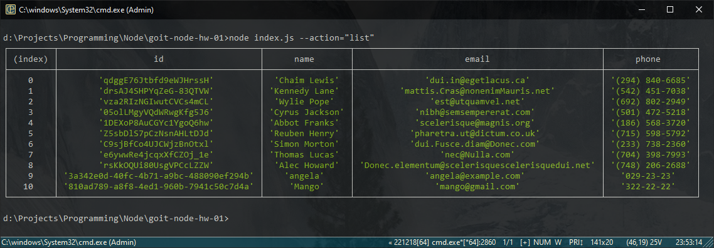
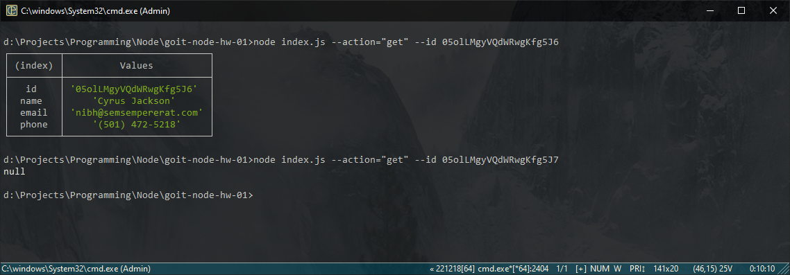
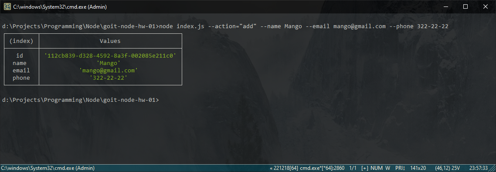
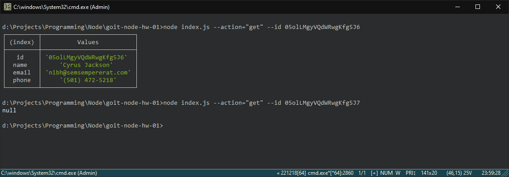

# Домашня робота #1

Проект є командним інтерфейсом для керування списком контактів. Він надає можливість додавати, видаляти, переглядати та отримувати контакти зі списку.

## Структура проекту

```bash
├── db/
│   └── contacts.json
├── README.md
├── contacts.js
├── index.js
├── package-lock.json
└── package.json
```

## Установка

1. Склонуйте репозиторій з GitHub.
   
```bash
git clone https://github.com/angelkapv81/goit-node-hw-01.git
```

2. Відкрийте термінал та перейдіть до папки проекту.
3. Виконайте команду `npm i`, щоб встановити необхідні пакети.

## Використання

Програма підтримує наступні команди:

1. `list` - вивести список контактів.

    ```bash
    node index.js --action list
    ```

2. `get` - отримати контакт за його ідентифікатором.

    ```bash
       node index.js --action get --id <id>
    ```

3. `add` - додати новий контакт.

    ```bash
       node index.js --action add --name <name> --email <email> --phone <phone>
    ```

4. `remove` - видалити контакт за його ідентифікатором.

    ```bash
       node index.js --action remove --id <id>
    ```

Зверніть увагу, що ви повинні замінити `<id>`, `<name>`, `<email>` та `<phone>` на відповідні значення.

## Додаткові вимоги

Також проект вимагає наявності файлу `contacts.json`, який містить список контактів у форматі JSON. Переконайтеся, що ви маєте цей файл перед запуском програми.

## Приклад використання

1. Отримуємо і виводимо весь список контактів у вигляді таблиці

    ```bash
    node index.js --action="list
    ```

    

2. Отримуємо контакт по id і виводимо у консоль об'єкт контакту або null, якщо контакту з таким id не існує.

    ```bash
    node index.js --action="get" --id 05olLMgyVQdWRwgKfg5J6
    ```

    

3. Додаємо контакт та виводимо в консоль об'єкт новоствореного контакту.

    ```bash
    node index.js --action="add" --name Mango --email mango@gmail.com --phone 322-22-22
    ```

    

4. Видаляємо контакт та виводимо в консоль об'єкт видаленого контакту або null, якщо контакту з таким id не існує.

    ```bash
    node index.js --action="remove" --id qdggE76Jtbfd9eWJHrssH
    ```

    
